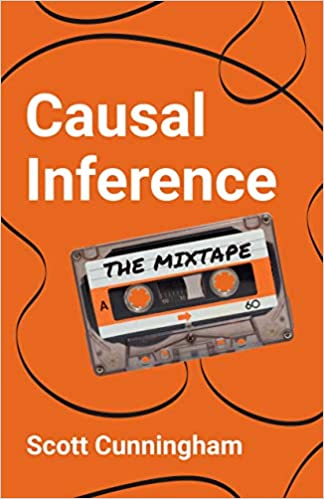

.. OSE-Data-Science documentation master file, created by
   sphinx-quickstart on Mon Jun  8 20:12:30 2020.
   You can adapt this file completely to your liking, but it should at least
   contain the root `toctree` directive.

.. |logo| image:: https://raw.githubusercontent.com/OpenSourceEconomics/ose-logos/main/OSE_logo_no_type_RGB.svg
  :width: 4 %

|logo| OSE data science
========================

.. image:: https://github.com/HumanCapitalAnalysis/ose-data-science/workflows/Continuous%20Integration/badge.svg
    :target: https://github.com/HumanCapitalAnalysis/ose-data-science/actions

.. image:: https://img.shields.io/badge/code%20style-black-000000.svg
    :target: https://github.com/psf/black

.. image:: https://img.shields.io/badge/zulip-join_chat-brightgreen.svg
    :target: https://bonn-econ-teaching.zulipchat.com

.. image:: https://img.shields.io/badge/License-MIT-yellow.svg
    :target: https://github.com/HumanCapitalAnalysis/ose-data-science/blob/master/LICENSE

.. image:: https://readthedocs.org/projects/ose-data-science/badge/?version=latest
    :target: https://ose-data-science.readthedocs.io

This course introduces students to basic microeconometric methods. The objective is to learn how to make and evaluate causal claims. By the end of the course, students should be able to apply each of the methods discussed and critically evaluate research based on them. Throughout the course we will make heavy use of `Python <https://www.python.org>`_ and its `SciPy ecosystem <https://www.scipy.org>`_ as well as `Jupyter Notebooks <https://jupyter.org>`_.

.. toctree::
   :maxdepth: 1

   lectures/index
   problem-sets/index
   handouts/index
   projects/index
   partners/index
   organization/index

Textbooks
---------

|space| |space| |mirandafackler| |space| |juddnumeriacal| |space| |space|

.. |mirandafackler| image:: images/fig-huntington-klein-2021.png
  :width: 20 %
  :target: https://www.theeffectbook.net/index.html

We use the book `The effect: an introduction to research design and causality <https://www.theeffectbook.net/index.html>`_ by `Nick Huntington-Klein <https://www.nickchk.com/>`_ and `Causal inference: the mixtape <https://yalebooks.yale.edu/book/9780300251685/causal-inference>`_ by `Scott Cunningham <https://www.scunning.com/>`_ throughout the course.

Reviews
-------

* **Athey, S., Imbens, G. (2017)**. book `The state of applied econometrics: causality and policy evaluation <https://www.aeaweb.org/articles?id=10.1257/jep.31.2.3>`_ , *Journal of Economics Perspectives*, 31(2).

Powered by
----------

|space| |space| |UNI| |space| |Nuvolos| |space| |GRN|

  

.. |space| raw:: html

     <embed>
   &nbsp; &nbsp; &nbsp; &nbsp; &nbsp; &nbsp; &nbsp; &nbsp; &nbsp;
     </embed>

We gratefully acknowledge funding by the Federal Ministry of Education and Research (BMBF) and the Ministry of Culture and Science of the State of North Rhine-Westphalia (MKW) as part of the Excellence Strategy of the federal and state governments.
